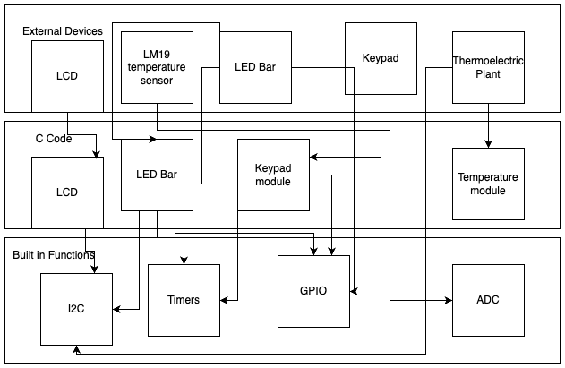

# EELE 465 project 6

# EELE 465 project 5

## Introduction

The goal of this project is to control the temperature of a "plant" using a thermoelectric device. There is a keypad controller which allows the user to select between three modes: heating, cooling, and temperature-matching. When in heating or cooling modes, the plant's Peltier device will only heat or cool respectively. When in temperature-matching mode, the plant will attempt to match the ambient temperature by switching between heating and cooling modes. The controller will also receive time data from an RTC. A slave processor will control a lightbar, which will indicate what mode is currently being used. Elapsed time, mode, ambient temperature, and plant temperature will be displayed on an LCD display. Temperature is displayed as a moving average using a specifiec window size.

## Architecture
There are a total of 6 external devices: LED Bar, LCD, an MSP430fr2310, a 4x4 membrane keypad and an LM19 temperature sensor, and thermoelectric plant containing a Peltier device. The C code contains functions for the LCD and LED Bar as well as keypad, temperature, and ADC modules. Below is a broad visualization of the program software architecture.

 

## Flowchart
The program allows the user to select from three modes on startup: heat, cool, or match, and starts in off mode. The LCD will indicate which of these modes have been entered. The system will switch to "off" mode after five minutes have passed. The LED Bar changes depending on what mode has been selected and the LCD's display changes to display elapsed time, mode, plant temperature, and ambient temperature.

 

## Circuit diagram
Below is the circuit diagram for the project.

## Repo structure

- [📁 `docs`](docs): documentation
- [📁 `controller`](controller): The CCS project for the main MCU.
    - [📁 `app`](controller/app): C files for LCD, Keypad, and Controller.
    - [📁 `src`](controller/src): Header files for LCD and Keypad.
- [📁 `i2c-led-bar`](i2c-led-bar): The CCS project for the I2C LED bar.

